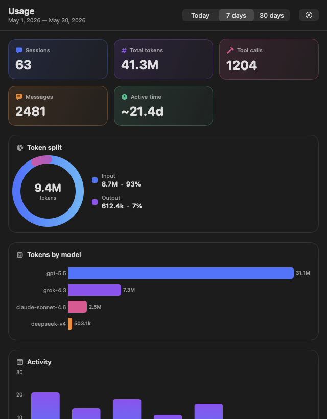
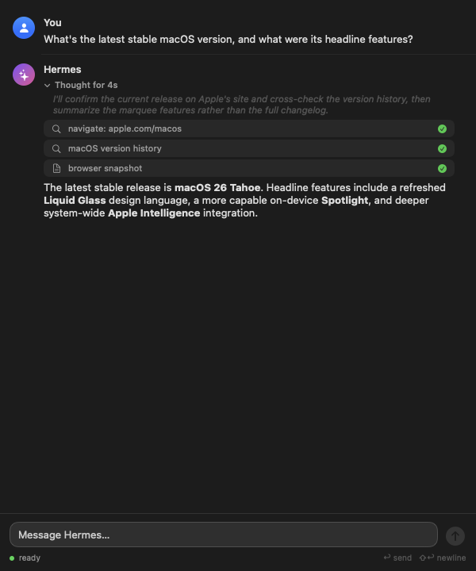

<div align="center">


# HermesLaunch

### The [Hermes Agent](https://github.com/NousResearch/hermes) — one click away in your menu bar.

Launch the TUI, manage the gateway, switch models, **chat with live streaming thinking & tool activity**, and watch a **beautiful usage dashboard** — all without opening a terminal.

<p>
  
  
  
  
  
</p>

<br/>

<table>
  <tr>
    <td width="52%"></td>
    <td width="48%"></td>
  </tr>
  <tr>
    <td align="center"><sub><b>Vibrant usage dashboard</b> — Swift Charts</sub></td>
    <td align="center"><sub><b>Live streaming chat</b> — thinking + tools, in real time</sub></td>
  </tr>
</table>

</div>

---

## ✦ Why HermesLaunch

Hermes is a powerful terminal-native AI agent. HermesLaunch wraps it in a **lightweight, native macOS
menu-bar app** so the things you do constantly — starting a session, checking usage, asking a quick
question — are always a click away. It's a single, dependency-free binary (just `swiftc` + the system
frameworks), built with AppKit for the menu-bar plumbing and **SwiftUI + Swift Charts** for the windows.

## ✨ Features

| | |
|---|---|
| 💬 **Quick Chat** | A streaming chat window over the Hermes **ACP** protocol. Watch the model's *thinking*, see tool/search activity light up in real time (`🔍 Searching… ✓`), and read the answer as it streams. Multi-turn while open. |
| 📊 **Usage dashboard** | A vibrant SwiftUI + Swift Charts view of `hermes insights`: stat cards, an input/output token donut, and bar charts for models, weekday activity, top tools, and platforms. |
| 🚀 **Process control** | Start/stop the TUI (under `caffeinate`), and start/stop/restart the messaging gateway — with live, color-coded status. |
| 🧠 **Models & profiles** | Save favorite models and one-click switch the persisted default; switch profiles; or open the full interactive picker. |
| 🪄 **Menu-bar display** | Show the icon, the current model name, or today's token count. The model name supports a **customizable color effect** — rainbow, solid, gradient wave, or pulse — with your own colors, speed, and tightness, edited in a live settings window. |
| 📨 **Send to Hermes** | A system-wide Services action: select text anywhere → *Services → Send to Hermes* → the reply lands on your clipboard. |
| 🩺 **At your fingertips** | Run `doctor`, tail logs, check for updates, and open the full web dashboard — straight from the menu. |

## 🖼 Screenshots

<div align="center">

<br/><br/>

</div>

## 📋 Requirements

- **macOS 13 (Ventura) or later** — uses SwiftUI + Swift Charts
- **Xcode Command Line Tools** — `xcode-select --install` (provides `swiftc`)
- **The [Hermes Agent](https://github.com/NousResearch/hermes) CLI** on your `PATH` (Quick Chat also uses `hermes acp`)
- *Optional:* [Ghostty](https://ghostty.org) for terminal actions — falls back to **Terminal.app** automatically

## 🚀 Quick start

```sh
git clone https://github.com/superluis0/HermesLaunch.git
cd HermesLaunch
./build.sh
open HermesLaunch.app
```

Install it for good (and add to Login Items if you like):

```sh
cp -R HermesLaunch.app /Applications/
```

HermesLaunch runs as a menu-bar accessory — no Dock icon. Look for the **H** mark in your menu bar.

## ⚙️ Configuration

HermesLaunch finds the `hermes` binary automatically (defaults override → `HERMES_BIN` →
`~/.local/bin`, Homebrew, `/usr/local/bin` → your shell's `PATH`). If it lives somewhere unusual:

```sh
defaults write com.hermeslaunch.HermesLaunch hermesPath /full/path/to/hermes
```

…then relaunch. If `hermes` can't be found at all, you'll get a one-time setup alert.

## 🏗 How it works

```
┌─────────────────────────────┐
│  Menu bar (AppKit)          │   status polling · profiles · gateway · services
│   ├─ Quick Chat   (SwiftUI) │── ACP JSON-RPC over stdio ──▶  hermes acp
│   └─ Usage board  (SwiftUI) │── parses ───────────────────▶  hermes insights
└─────────────────────────────┘            shells out ──────▶  hermes <cmd>
```

The app is a thin front-end: it shells out to your `hermes` CLI, which manages its own credentials
in `~/.hermes`. **No API keys or secrets are stored in this project.**

## 🧹 Uninstall

```sh
# Quit from the menu bar first, then:
rm -rf /Applications/HermesLaunch.app
defaults delete com.hermeslaunch.HermesLaunch   # clears saved preferences
```

## 🤝 Contributing

Issues and PRs welcome. The whole app is a handful of Swift files compiled by `build.sh`
(`main.swift`, `HermesLaunch.swift`, `QuickChat.swift`, `ChatView.swift`, `UsageDashboard.swift`) —
no project file, no package manager.

The app icon is generated from code: edit `make_icon.swift`, then run `./make_icons.sh` to
regenerate the master PNG, the `.iconset`, and `AppIcon.icns`.

## 📄 License

[MIT](LICENSE) — do whatever you like.

<div align="center"><sub>Built with ☕ for the Hermes community.</sub></div>
