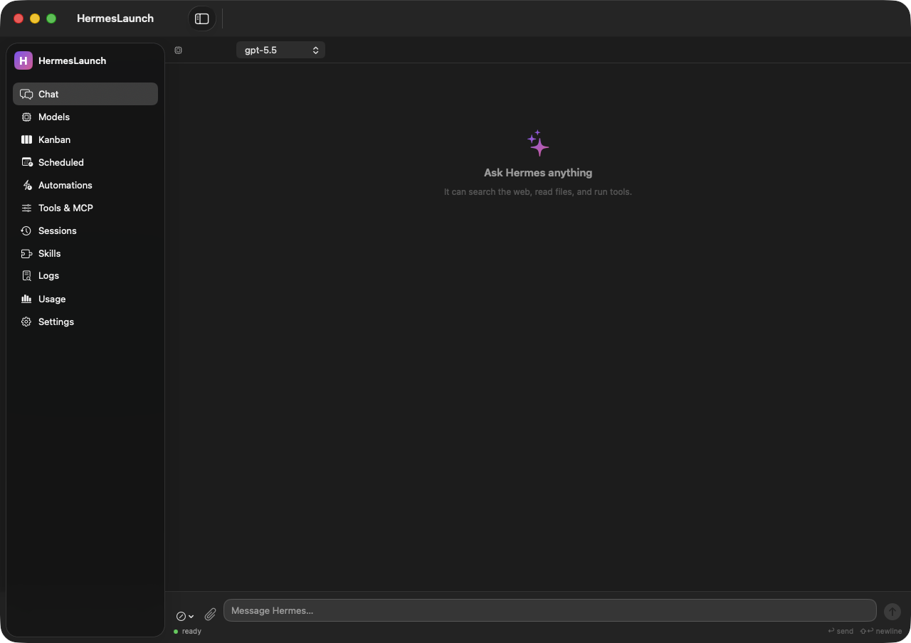
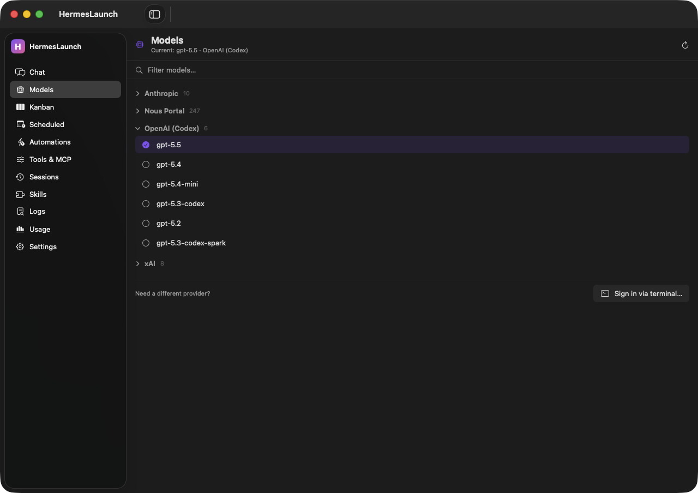
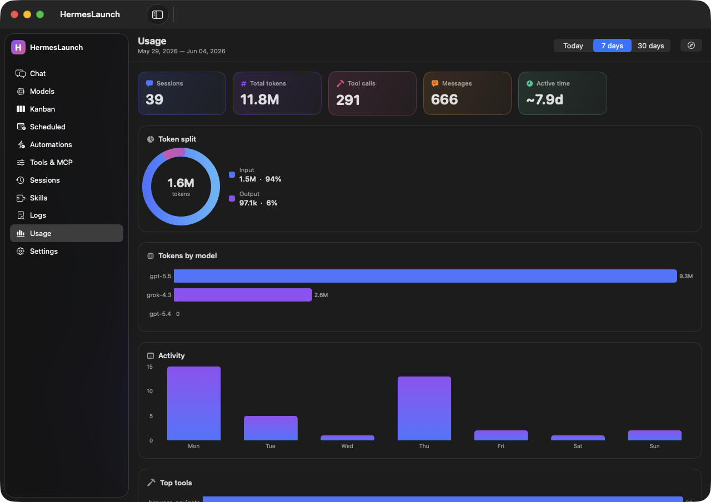
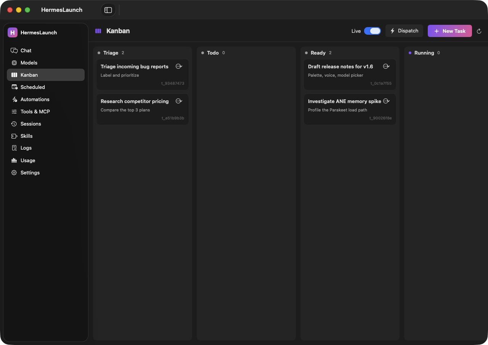
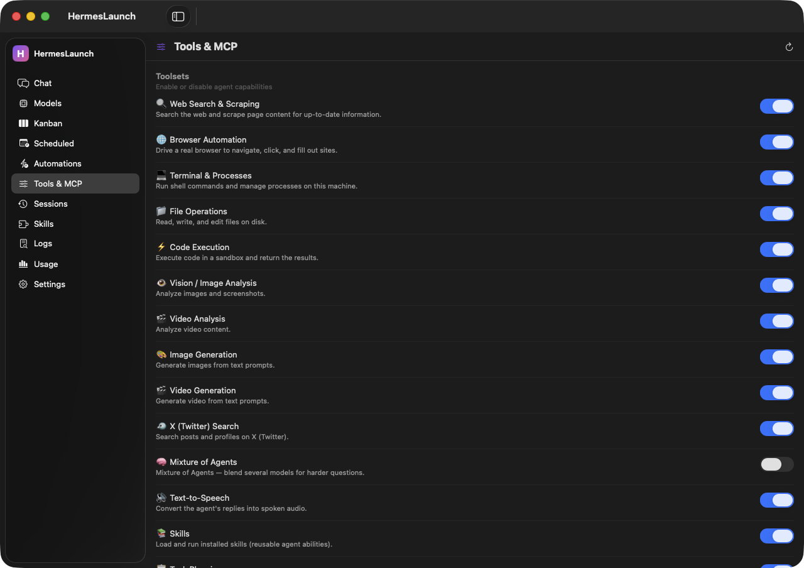
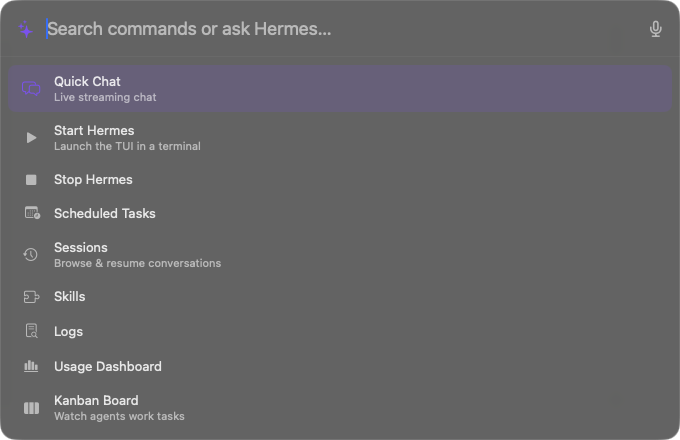
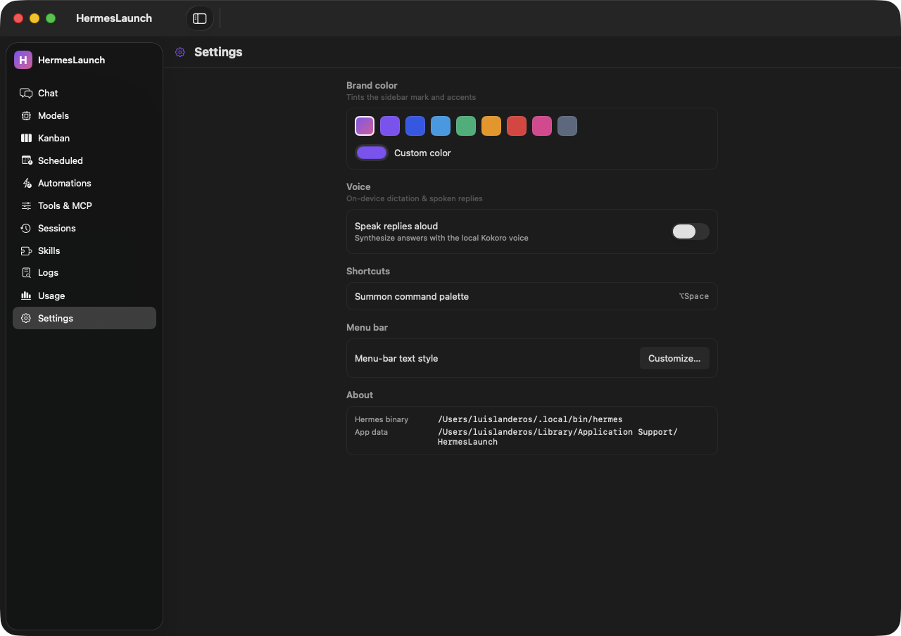
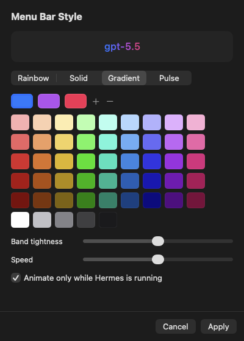

<div align="center">


# HermesLaunch

### A native macOS app for the [Hermes Agent](https://github.com/NousResearch/hermes) — one window for everything, one keystroke away.

Chat with live streaming thinking, **talk to the agent** with on-device voice, switch models, watch swarm agents work a **live Kanban board**, manage tools & automations, and read a **beautiful usage dashboard** — all in one unified window, with a menu-bar companion and a global command palette. No terminal required.

<p>
  
  
  
  
  
</p>

<br/>



<sub><b>One window, everything in reach</b> — a sidebar for Chat, Models, Kanban, Tools, Automations, Sessions, Usage and more.</sub>

</div>

---

## ✦ Why HermesLaunch

Hermes is a powerful terminal-native AI agent. HermesLaunch wraps it in a **first-class native macOS
app**: a single window with a sidebar where every capability is a pane, plus a **menu-bar companion**
for quick access and a **global command palette** (⌥Space) from anywhere. It's built with AppKit +
**SwiftUI + Swift Charts**, with on-device voice powered by the
[FluidAudio](https://github.com/FluidInference/FluidAudio) Swift package (Parakeet ASR + Kokoro TTS,
on the Apple Neural Engine) — **no cloud, no API keys**.

Hybrid by design: it launches as a menu-bar accessory (no Dock icon); opening the main window promotes
it to a full Dock app, and closing the window drops it back to the menu bar.

## 🪟 One window, every tool

<div align="center">
<table>
  <tr>
    <td width="50%"></td>
    <td width="50%"></td>
  </tr>
  <tr>
    <td align="center"><sub><b>Models</b> — switch the default model in-app, collapsible by provider</sub></td>
    <td align="center"><sub><b>Usage</b> — Swift Charts over <code>hermes insights</code></sub></td>
  </tr>
  <tr>
    <td width="50%"></td>
    <td width="50%"></td>
  </tr>
  <tr>
    <td align="center"><sub><b>Kanban</b> — watch swarm agents work, live</sub></td>
    <td align="center"><sub><b>Tools & MCP</b> — toggle capabilities, manage servers</sub></td>
  </tr>
</table>
</div>

## ⌘ Command palette & voice

Press **⌥Space** from any app. Fuzzy-search commands, jump to any pane, resume a recent session, or ask
Hermes a question and watch the answer stream inline. Click the mic to **dictate locally**, and turn on
**Speak Replies** to hear the answer — all on-device.

<div align="center">

</div>

## ✨ Features

| | |
|---|---|
| 🪟 **Unified app window** | One window with a sidebar — Chat, Models, Kanban, Scheduled, Automations, Tools & MCP, Sessions, Skills, Logs, Usage, Settings. Hybrid presence: a menu-bar companion always, a Dock icon while the window is open. |
| ⌘ **Command palette** | **⌥Space** anywhere opens a Spotlight/Raycast-style palette — fuzzy-search every action, jump to any pane, **resume recent sessions**, or type a question for an **inline streaming answer**. Also driven by `hermeslaunch://` URLs. |
| 🎙 **Local voice** | **Push-to-talk dictation** into the palette and optional **spoken replies** — fully on-device via FluidAudio's Parakeet (STT) and Kokoro (TTS) CoreML models on the ANE. Audio never leaves your Mac. |
| 💬 **Chat** | Streaming chat over the Hermes **ACP** protocol — watch *thinking* and tool/search activity in real time, then the streamed answer. **Switch models mid-chat**, run **slash commands**, and **attach images**. |
| 🧠 **In-app model picker** | Browse every authenticated provider's models (**collapsible by provider**), see the current one, and switch the default with a click — no terminal. New-provider sign-in (OAuth) opens the wizard when needed. |
| 🗂 **Kanban board** | A native board over `hermes kanban` — **watch swarm agents work tasks live** (3-second refresh), and drive the full lifecycle: create, promote, assign, comment, block/unblock, complete, archive, **dispatch**. |
| 🎛 **Tools & MCP manager** | Toggle the agent's **toolsets** (each with a description) and **add / remove MCP servers** — no `config.yaml` editing. |
| ⚡ **Automations hub** | Event-driven + scheduled activation in one place: **cron** jobs, shell **hooks**, and **webhooks**. |
| 📊 **Usage dashboard** | SwiftUI + Swift Charts over `hermes insights`: stat cards, an input/output token donut, and bars for models, activity, top tools — over Today / 7d / 30d, plus the full **web dashboard**. |
| 🗂 **Sessions · Skills · Logs** | Search/resume past conversations; install/update/uninstall skills; tail and filter logs — each a pane. |
| 🚀 **Launch the TUI, caffeinated** | Start a TUI session in one click under `caffeinate -is`, so your Mac won't sleep mid-run. Auto-starts the gateway. |
| ⏰ **Scheduled tasks** | Create/run/pause/delete recurring agent jobs (`hermes cron`) with a visual schedule builder and a delivery target. |
| 🎨 **Make it yours** | Pick a **brand color** for the sidebar mark + accents, and style the menu-bar model text (rainbow / solid / gradient / pulse) — both with live in-app pickers. |
| 🛰 **Gateway control** | Start / stop / restart the messaging gateway, see live status & PID, tail logs, or **send a one-off message**. |
| 📨 **Send to Hermes** | A system-wide **Services** action: select text in any app → reply copied to your clipboard. |
| 🔁 **Self-updating** | Run from a git clone and HermesLaunch can **pull → rebuild → relaunch** when new commits land. |
| 🔔 **Ambient + notifications** | A "▶ agents working" menu indicator and macOS notifications when tasks finish, the TUI exits, or an update is ready. |

## 🎨 Make it yours

Choose a **brand color** for the sidebar mark and accents from the swatches or a full color picker, and
style the **menu-bar model text** — rainbow, solid, a gradient through your own colors, or a gentle pulse.

<div align="center">
<table>
  <tr>
    <td width="50%"></td>
    <td width="50%"></td>
  </tr>
  <tr>
    <td align="center"><sub><b>Settings</b> — brand color, voice, shortcuts</sub></td>
    <td align="center"><sub><b>Menu-bar style</b> — swatches, sliders, live preview</sub></td>
  </tr>
</table>
</div>

## 🧭 Menu-bar companion

The menu-bar **H** stays a fast launcher even when the window is closed:

- **Open HermesLaunch** `⌘1` — open the main window (any pane)
- **Command Palette…** `⌘K` *(or **⌥Space** anywhere)* — fuzzy search + inline AI + voice
- **▶ N agents working…** — appears when Kanban tasks are running *(auto-hidden when idle)*
- **Status / Today** — current model · provider and today's session/token usage *(read-only)*
- **● Update available** / **● HermesLaunch update available** — install Hermes or pull-rebuild-relaunch the app
- **Speak Replies** — toggle on-device spoken answers
- **Gateway ▸** · **Profile ▸** · **Model ▸** (favorites + in-app picker) · **Run Doctor** · **Usage…**
- **Manage ▸** (Scheduled · Sessions · Skills · Logs · Back Up · Restore) · **Cockpit ▸** (Kanban · Tools & MCP · Automations)
- **Start / Stop Hermes** `⌘S` / `⌘X` · **Resume Session ▸** · **About** · **Quit** `⌘Q`

**Menu-bar icon states:** ⚪ idle · 🔵 TUI running · 🔴 gateway installed but stopped.
**Terminal:** TUI / wizard actions open in [Ghostty](https://ghostty.org) if installed, else **Terminal.app**.

## 📋 Requirements

- **macOS 14 (Sonoma) or later** — required by the FluidAudio voice engine (CoreML / ANE)
- **Xcode Command Line Tools** — `xcode-select --install` (provides the Swift toolchain & `swift build`)
- **The [Hermes Agent](https://github.com/NousResearch/hermes) CLI** on your `PATH` (Chat & the palette also use `hermes acp`)
- *Optional:* a **microphone** for voice dictation — macOS prompts on first use; transcription is on-device
- *Optional:* [Ghostty](https://ghostty.org) for terminal actions — falls back to **Terminal.app** automatically

## 🚀 Quick start

```sh
git clone https://github.com/superluis0/HermesLaunch.git
cd HermesLaunch
./build.sh            # first run fetches FluidAudio via SwiftPM
open HermesLaunch.app
```

Install it for good (and add to Login Items if you like):

```sh
cp -R HermesLaunch.app /Applications/
```

HermesLaunch starts in your menu bar (look for the **H**). Open the main window from the menu or with
**⌘1** / **⌥Space** — a Dock icon appears while it's open and disappears when you close it.

## ⚙️ Configuration

HermesLaunch finds the `hermes` binary automatically (defaults override → `HERMES_BIN` →
`~/.local/bin`, Homebrew, `/usr/local/bin` → your shell's `PATH`). If it lives somewhere unusual:

```sh
defaults write com.hermeslaunch.HermesLaunch hermesPath /full/path/to/hermes
```

…then relaunch. If `hermes` can't be found at all, you'll get a one-time setup alert.

## 🏗 How it works

```
┌───────────────────────────────┐
│  Menu bar (AppKit) + palette   │   status polling · gateway · services · ⌥Space summon
│                                │
│  Main window  (SwiftUI)        │
│   ├─ Chat / Models  ───────────│── ACP JSON-RPC over stdio ──▶  hermes acp
│   ├─ Kanban / Tools / Auto ────│── shells out ───────────────▶  hermes kanban · tools · mcp · cron …
│   ├─ Usage  ───────────────────│── parses ───────────────────▶  hermes insights
│   └─ Voice  (FluidAudio) ──────│── on-device CoreML / ANE ───▶  Parakeet ASR · Kokoro TTS
└───────────────────────────────┘            shells out ──────▶  hermes <cmd>
```

The app is a thin front-end: it shells out to your `hermes` CLI, which manages its own credentials in
`~/.hermes`. Voice runs entirely on-device via [FluidAudio](https://github.com/FluidInference/FluidAudio)
(Apache-2.0); its CoreML models download once to `~/Library/Application Support/FluidAudio/`.
**No API keys or secrets are stored in this project, and audio never leaves your Mac.**

## 🧹 Uninstall

```sh
# Quit from the menu bar first, then:
rm -rf /Applications/HermesLaunch.app
defaults delete com.hermeslaunch.HermesLaunch   # clears saved preferences
```

## 🤝 Contributing

Issues and PRs welcome. The app builds via **SwiftPM** (`./build.sh` → `swift build -c release`, see
`Package.swift`) and is assembled into the `.app` bundle. The shell + panes live in `AppShell.swift`,
`MainWindowController.swift`, `CommandPalette.swift`, `Voice.swift`, `ModelPicker.swift`,
`KanbanBoard.swift`, `ToolsMCP.swift`, `Automations.swift`, `ScheduledTasks.swift`, `SessionsBrowser.swift`,
`SkillsBrowser.swift`, `LogViewer.swift`, `UsageDashboard.swift`, `ChatView.swift`, plus
`DesignSystem.swift` / `Settings.swift` and the menu-bar core in `HermesLaunch.swift`. The only external
dependency is [FluidAudio](https://github.com/FluidInference/FluidAudio) (fetched on first build).

The app icon is generated from code: edit `make_icon.swift`, then run `./make_icons.sh`. README
screenshots are captured with `./make_screenshots.sh` (needs Screen Recording permission for your terminal).

## 📄 License

[MIT](LICENSE) — do whatever you like.

<div align="center"><sub>Built with ☕ for the Hermes community.</sub></div>
