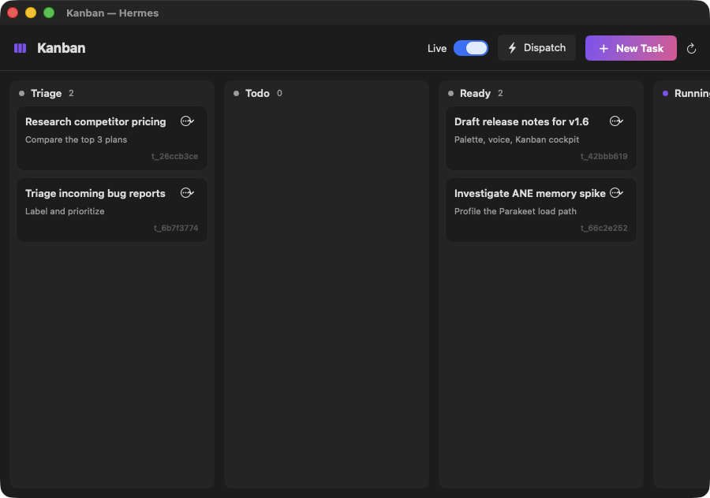
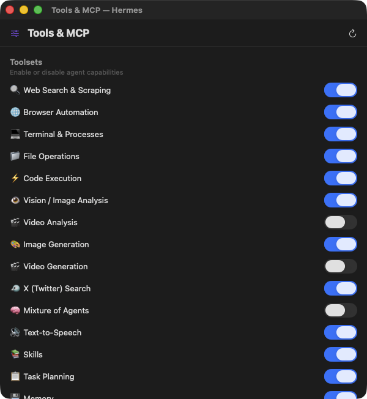
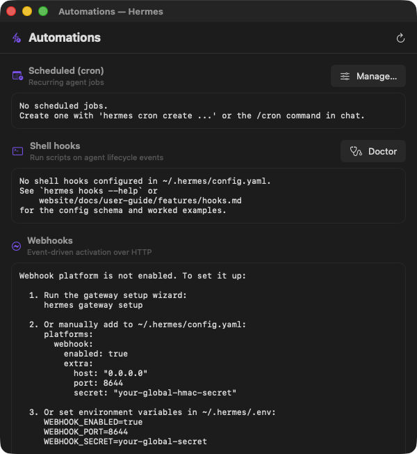
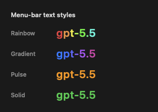
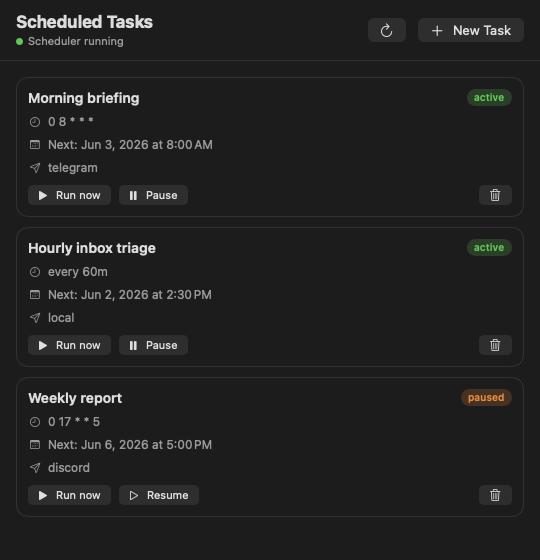
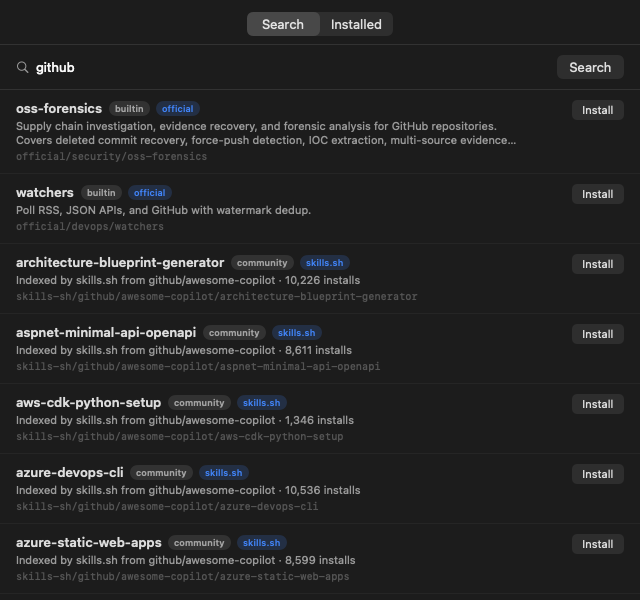
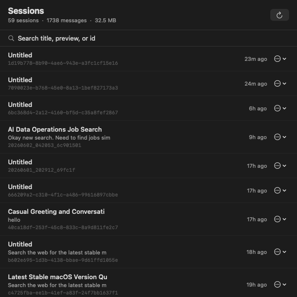

<div align="center">


# HermesLaunch

### The [Hermes Agent](https://github.com/NousResearch/hermes) — one click away in your menu bar.

Summon a **command palette** from anywhere, **talk to the agent** with on-device voice, watch swarm agents work a **live Kanban board**, launch the TUI, schedule recurring tasks, **chat with live streaming thinking & tool activity**, and watch a **beautiful usage dashboard** — all without opening a terminal.

<p>
  
  
  
  
  
</p>

<br/>

<table>
  <tr>
    <td width="52%"></td>
    <td width="48%"></td>
  </tr>
  <tr>
    <td align="center"><sub><b>Vibrant usage dashboard</b> — Swift Charts</sub></td>
    <td align="center"><sub><b>Live streaming chat</b> — thinking + tools, in real time</sub></td>
  </tr>
</table>

</div>

---

## ✦ Why HermesLaunch

Hermes is a powerful terminal-native AI agent. HermesLaunch wraps it in a **lightweight, native macOS
menu-bar app** so the things you do constantly — starting a session, checking usage, asking a quick
question — are always a keystroke away. It's built with AppKit for the menu-bar plumbing and
**SwiftUI + Swift Charts** for the windows, with on-device voice powered by the
[FluidAudio](https://github.com/FluidInference/FluidAudio) Swift package (Parakeet ASR + Kokoro TTS,
running on the Apple Neural Engine) — **no cloud, no API keys**.

## ✨ Features

| | |
|---|---|
| ⌘ **Command palette** | Press **⌥Space** anywhere to summon a Spotlight/Raycast-style palette — fuzzy-search every action (chat, start/stop, schedule, open any window), **resume recent sessions**, or just type a question and press ⏎ for an **inline streaming answer** from Hermes. The cohesion spine of the whole app; also reachable via `hermeslaunch://` URLs. |
| 🎙 **Local voice** | **Push-to-talk dictation** straight into the palette (click the mic) and optional **spoken replies** — both fully on-device via FluidAudio's Parakeet (speech-to-text) and Kokoro (text-to-speech) CoreML models on the Apple Neural Engine. Private by default; audio never leaves your Mac. |
| 🗂 **Kanban board** | A native board over `hermes kanban` — **watch swarm agents work tasks in real time** (3-second live refresh), and drive the full lifecycle: create, promote, assign, comment, block/unblock, complete, archive, and **dispatch** agents. |
| 🎛 **Tools & MCP manager** | Toggle the agent's **toolsets** (web, browser, code execution, vision, memory, …) with a switch, and **add / remove MCP servers** — no `config.yaml` editing. |
| ⚡ **Automations hub** | One place for event-driven + scheduled activation: **cron** jobs, shell **hooks**, and **webhooks** — see status across all three trigger types. |
| 🚀 **Launch the TUI, caffeinated** | Start a Hermes TUI session in one click. It runs under macOS **`caffeinate -is`**, so your Mac **won't sleep** while the agent is working — long runs and overnight tasks keep going. Stopping the session lets your Mac sleep normally again. Starting a session also auto-starts the messaging gateway. |
| 💬 **Quick Chat** | A streaming chat over the Hermes **ACP** protocol — watch the model's *thinking* and tool/search activity in real time (`🔍 Searching… ✓`), then the streamed answer. **Switch models mid-chat**, run **slash commands** (`/reset`, `/compact`, …), and **attach images**. Multi-turn while the window is open. |
| ⏰ **Scheduled tasks** | Create, run, pause, and delete recurring agent jobs (`hermes cron`) from a panel, with a **visual schedule builder** — Once / Every / Daily / Weekly / Custom-cron — plus a prompt and a delivery target (Telegram/Discord/local). Turns the menu bar into a cockpit for autonomous tasks. |
| 📊 **Usage dashboard** | A vibrant SwiftUI + Swift Charts view of `hermes insights`: stat cards (sessions, tokens, tool calls, messages, active time), an input/output token donut, and bar charts for models, weekday activity, top tools, and platforms — over Today / 7 days / 30 days. Plus a one-click link to the full **web dashboard**. |
| 🗂 **Sessions browser** | Search, rename, delete, and resume past conversations, with a store-stats header (sessions · messages · DB size). Resuming runs caffeinated, gateway ensured. |
| 🧩 **Skills browser** | Search the skill registries and **install / update / uninstall** skills — a mini app-store for the agent's abilities, right from the menu bar. |
| 🛰 **Gateway control** | Start / stop / restart the messaging gateway, see live status and PID, tail logs, reveal the logs folder, or **send a one-off message** to Telegram/Discord/Slack/Signal. |
| 🧠 **Models & profiles** | Save favorite models and one-click switch the persisted default; switch *or create* profiles; or open the full interactive picker. |
| 🪄 **Menu-bar display** | Show the icon, the current model name, or today's token count. The model name supports a **customizable color effect** — rainbow, solid, gradient wave, or pulse — with your own colors, speed, and band tightness, edited in a live, in-app settings window. |
| 🪵 **Log viewer** | View, follow, and filter the agent · errors · gateway · gui logs (by level) in a native window — no terminal needed. |
| 💾 **Backup & restore** | One-click zip backup of your entire Hermes setup, and restore from a backup. |
| 📨 **Send to Hermes** | A system-wide **Services** action: select text in *any* app → *Services → Send to Hermes* → the reply is copied to your clipboard with a preview notification. |
| 🔁 **Self-updating** | When run from a git clone, HermesLaunch notices new commits on its GitHub repo, notifies you, and can **pull → rebuild → relaunch** in one click. |
| 📡 **Status at a glance** | A color-coded menu-bar icon plus header rows showing the current model · provider and today's session/token usage — refreshed by 5-second background polling. |
| 🩺 **Diagnostics & updates** | Run `hermes doctor` (results summarized, full output on failure), and get notified when a new Hermes version is available — install it from the menu. |
| 🔔 **Native notifications** | macOS notifications when the TUI exits, the gateway stops, an update is available, doctor finishes, or a *Send to Hermes* reply is ready. |

## ⌘ Command palette & voice

Press **⌥Space** from any app. Fuzzy-search commands, resume a recent session, or ask Hermes a
question and watch the answer stream inline. Click the mic to **dictate locally**, and flip on
**Speak Replies** to hear the answer — all on-device.

<div align="center">

</div>

## 🛰 Agent cockpit

Drive the deeper parts of Hermes — task swarms, toolsets, MCP servers, and automations — from native windows.

<div align="center">
<table>
  <tr>
    <td width="40%"></td>
    <td width="30%"></td>
    <td width="30%"></td>
  </tr>
  <tr>
    <td align="center"><sub><b>Kanban</b> — watch agents work, live</sub></td>
    <td align="center"><sub><b>Tools & MCP</b> — toggle capabilities</sub></td>
    <td align="center"><sub><b>Automations</b> — cron · hooks · webhooks</sub></td>
  </tr>
</table>
</div>

## 🖼 Screenshots

<div align="center">

<br/><br/>

</div>

## 🎨 Make it yours

Style the menu-bar model name however you like — **rainbow**, **solid**, a **gradient** through your own colors, or a gentle **pulse** — all from an **in-app color picker with a live preview** (no system color panel, just tap a shade).

<div align="center">
<table>
  <tr>
    <td width="56%"></td>
    <td width="44%"></td>
  </tr>
  <tr>
    <td align="center"><sub><b>In-app style editor</b> — swatches, sliders, live preview</sub></td>
    <td align="center"><sub><b>Four effects</b>, your colors</sub></td>
  </tr>
</table>
</div>

## 🗂 A control panel for Hermes

Everything Hermes can do — scheduling, sessions, skills — without a terminal.

<div align="center">
<table>
  <tr>
    <td width="34%"></td>
    <td width="33%"></td>
    <td width="33%"></td>
  </tr>
  <tr>
    <td align="center"><sub><b>Scheduled tasks</b> — recurring agent jobs</sub></td>
    <td align="center"><sub><b>Skills</b> — search & install</sub></td>
    <td align="center"><sub><b>Sessions</b> — search, resume, manage</sub></td>
  </tr>
</table>
</div>

## 🧭 What's in the menu

Click the menu-bar **H** to get:

- **Status** — current model · provider *(read-only)*
- **Today** — sessions · tokens used today *(read-only)*
- **● Update available** — a newer **Hermes** is out; click to install
- **● HermesLaunch update available** — new commits on the repo; click to pull, rebuild & relaunch *(only when run from a git clone)*
- **▶ N agents working…** — appears when Kanban tasks are running; click to open the board *(auto-hidden when idle)*
- **Command Palette…** `⌘K` *(or **⌥Space** from anywhere)* — fuzzy command search + inline AI + voice dictation
- **Speak Replies** — toggle on-device spoken answers (Kokoro TTS)
- **Quick Chat…** `⌘A` — streaming chat (switch model mid-chat · slash commands · attach images)
- **Gateway ▸** — Status (running/PID) · Restart · Stop · Start · Tail Logs · Reveal Logs in Finder · **Send Message…**
- **Profile: \<name\> ▸** — switch the active profile · **New Profile…**
- **Model ▸** — favorites (one click to switch) · Save Current as Favorite · Forget Favorite · Change Model… (full picker)
- **Run Doctor** — run `hermes doctor` and summarize the results
- **Usage…** — open the in-app usage dashboard (+ *Open Full Dashboard…*)
- **Manage ▸** — **Scheduled Tasks…** · **Sessions…** · **Skills…** · **Logs…** · **Back Up…** · **Restore from Backup…**
- **Cockpit ▸** — **Kanban Board…** · **Tools & MCP…** · **Automations…**
- **Menu Bar Display ▸** — Icon only · Show model · Show today's tokens · **Customize Style…**
- **Start Hermes** `⌘S` — launch the TUI (caffeinated; auto-starts the gateway)
- **Stop Hermes** `⌘X` — stop the running TUI session
- **Resume Session ▸** — your 10 most recent sessions
- **About HermesLaunch** — app + Hermes versions
- **Quit** `⌘Q`

**Menu-bar icon states:** ⚪ idle (adapts to light/dark) · 🔵 TUI session running · 🔴 gateway installed but stopped.

**Terminal:** TUI / logs / picker actions open in [Ghostty](https://ghostty.org) if it's installed, otherwise in **Terminal.app** automatically.

## 📋 Requirements

- **macOS 14 (Sonoma) or later** — required by the FluidAudio voice engine (CoreML / ANE)
- **Xcode Command Line Tools** — `xcode-select --install` (provides the Swift toolchain & `swift build`)
- **The [Hermes Agent](https://github.com/NousResearch/hermes) CLI** on your `PATH` (Quick Chat & the palette also use `hermes acp`)
- *Optional:* a **microphone** for voice dictation — macOS prompts on first use; transcription is on-device
- *Optional:* [Ghostty](https://ghostty.org) for terminal actions — falls back to **Terminal.app** automatically

## 🚀 Quick start

```sh
git clone https://github.com/superluis0/HermesLaunch.git
cd HermesLaunch
./build.sh            # first run fetches FluidAudio via SwiftPM
open HermesLaunch.app
```

Install it for good (and add to Login Items if you like):

```sh
cp -R HermesLaunch.app /Applications/
```

HermesLaunch runs as a menu-bar accessory — no Dock icon. Look for the **H** mark in your menu bar.

## ⚙️ Configuration

HermesLaunch finds the `hermes` binary automatically (defaults override → `HERMES_BIN` →
`~/.local/bin`, Homebrew, `/usr/local/bin` → your shell's `PATH`). If it lives somewhere unusual:

```sh
defaults write com.hermeslaunch.HermesLaunch hermesPath /full/path/to/hermes
```

…then relaunch. If `hermes` can't be found at all, you'll get a one-time setup alert.

## 🏗 How it works

```
┌─────────────────────────────┐
│  Menu bar (AppKit)          │   status polling · profiles · gateway · services
│   ├─ Command palette        │── ACP JSON-RPC over stdio ──▶  hermes acp   (inline AI)
│   ├─ Quick Chat   (SwiftUI) │── ACP JSON-RPC over stdio ──▶  hermes acp
│   ├─ Kanban / Tools / Auto  │── shells out ───────────────▶  hermes kanban · tools · mcp · cron …
│   ├─ Usage board  (SwiftUI) │── parses ───────────────────▶  hermes insights
│   └─ Voice  (FluidAudio)    │── on-device CoreML / ANE ────▶  Parakeet ASR · Kokoro TTS
└─────────────────────────────┘            shells out ──────▶  hermes <cmd>
```

The app is a thin front-end: it shells out to your `hermes` CLI, which manages its own credentials
in `~/.hermes`. Voice runs entirely on-device via [FluidAudio](https://github.com/FluidInference/FluidAudio)
(Apache-2.0); its CoreML models download once to `~/Library/Application Support/FluidAudio/`.
**No API keys or secrets are stored in this project, and audio never leaves your Mac.**

## 🧹 Uninstall

```sh
# Quit from the menu bar first, then:
rm -rf /Applications/HermesLaunch.app
defaults delete com.hermeslaunch.HermesLaunch   # clears saved preferences
```

## 🤝 Contributing

Issues and PRs welcome. The app is a set of Swift files built by `build.sh` via **SwiftPM**
(`swift build -c release`, see `Package.swift`) and then assembled into the `.app` bundle:
menu bar & windows (`main.swift`, `HermesLaunch.swift`, `QuickChat.swift`, `ChatView.swift`,
`UsageDashboard.swift`, `MenuBarStyleSettings.swift`, `ScheduledTasks.swift`, `SessionsBrowser.swift`,
`LogViewer.swift`, `SkillsBrowser.swift`), plus the newer surfaces — `DesignSystem.swift`,
`Settings.swift`, `CommandPalette.swift`, `Voice.swift`, `KanbanBoard.swift`, `ToolsMCP.swift`,
`Automations.swift`. The only external dependency is
[FluidAudio](https://github.com/FluidInference/FluidAudio) (fetched automatically on first build).

The app icon is generated from code: edit `make_icon.swift`, then run `./make_icons.sh` to
regenerate the master PNG, the `.iconset`, and `AppIcon.icns`. README screenshots are captured with
`./make_screenshots.sh` (needs Screen Recording permission for your terminal).

## 📄 License

[MIT](LICENSE) — do whatever you like.

<div align="center"><sub>Built with ☕ for the Hermes community.</sub></div>
